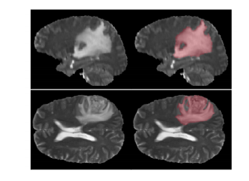
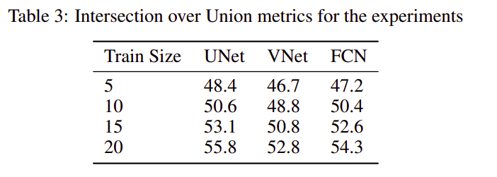
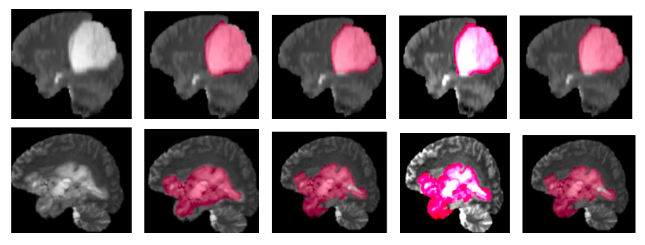

# Uncertainty Quantification using Variational Inference for Biomedical Image Segmentation

Code for the paper `Uncertainty Quantification using Variational Inference for Biomedical Image Segmentation`.

https://arxiv.org/pdf/2008.07588.pdf


## Abstract

Deep learning motivated by convolutional neural networks has been highly successful in a range of medical imaging problems like image classification, image
segmentation, image synthesis etc. However for validation and interpretability, not
only do we need the predictions made by the model but also how confident it is
while making those predictions. This is important in safety critical applications for
the people to accept it. In this work, we used an encoder decoder architecture based
on variational inference techniques for segmenting brain tumour images. We compared different backbones architectures like U-Net, V-Net and FCN as sampling
data from the conditional distribution for the encoder. We evaluate our work on
the publicly available BRATS dataset using Dice Similarity Coefficient (DSC) and
Intersection Over Union (IOU) as the evaluation metrics. Our model outperforms
previous state of the art results while making use of uncertainty quantification in a
bayesian manner.

## Data

The dataset can be downloaded from [here](http://braintumorsegmentation.org/).



## Network Architecture


## Algorithm


## Usage

`python train.py`

## Results





### Examples of models predictions on test samples, compared to ground truth segmentation. First column: input image, second column: ground truth segmentation, third column: predicted segmentation, fourth column: aleatoric uncertainty and fifth column: epistemic uncertainty.



## Citing

If you find this code useful in your research, please consider citing the paper:

BibTex:

```
@article{sagar2020uncertainty,
  title={Uncertainty Quantification using Variational Inference for Biomedical Image Segmentation},
  author={Sagar, Abhinav},
  journal={arXiv preprint arXiv:2008.07588},
  year={2020}
}
```

MLA:

`Sagar, Abhinav. "Uncertainty Quantification using Variational Inference for Biomedical Image Segmentation." arXiv preprint arXiv:2008.07588 (2020).`

## License

```
MIT License

Copyright (c) 2020 Abhinav Sagar

Permission is hereby granted, free of charge, to any person obtaining a copy
of this software and associated documentation files (the "Software"), to deal
in the Software without restriction, including without limitation the rights
to use, copy, modify, merge, publish, distribute, sublicense, and/or sell
copies of the Software, and to permit persons to whom the Software is
furnished to do so, subject to the following conditions:

The above copyright notice and this permission notice shall be included in all
copies or substantial portions of the Software.

THE SOFTWARE IS PROVIDED "AS IS", WITHOUT WARRANTY OF ANY KIND, EXPRESS OR
IMPLIED, INCLUDING BUT NOT LIMITED TO THE WARRANTIES OF MERCHANTABILITY,
FITNESS FOR A PARTICULAR PURPOSE AND NONINFRINGEMENT. IN NO EVENT SHALL THE
AUTHORS OR COPYRIGHT HOLDERS BE LIABLE FOR ANY CLAIM, DAMAGES OR OTHER
LIABILITY, WHETHER IN AN ACTION OF CONTRACT, TORT OR OTHERWISE, ARISING FROM,
OUT OF OR IN CONNECTION WITH THE SOFTWARE OR THE USE OR OTHER DEALINGS IN THE
SOFTWARE.
```

